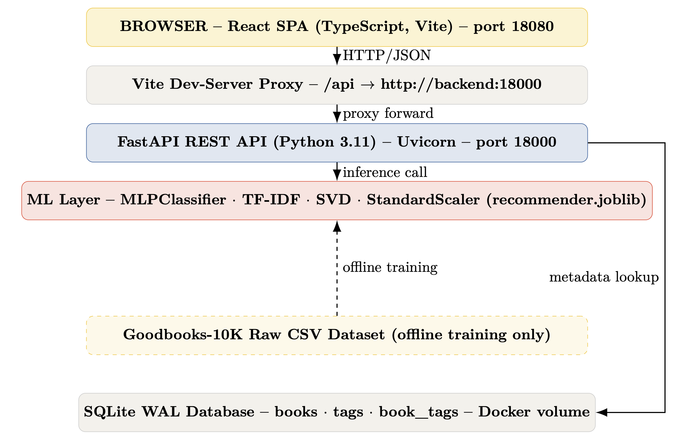
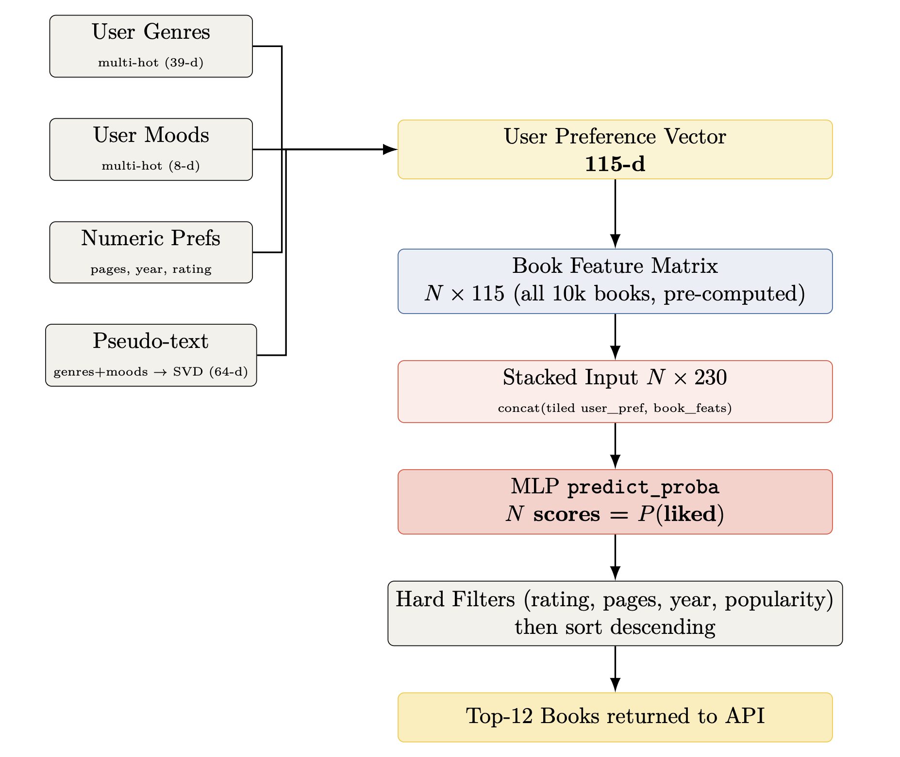
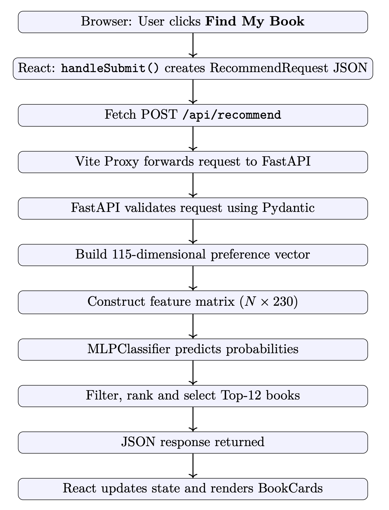
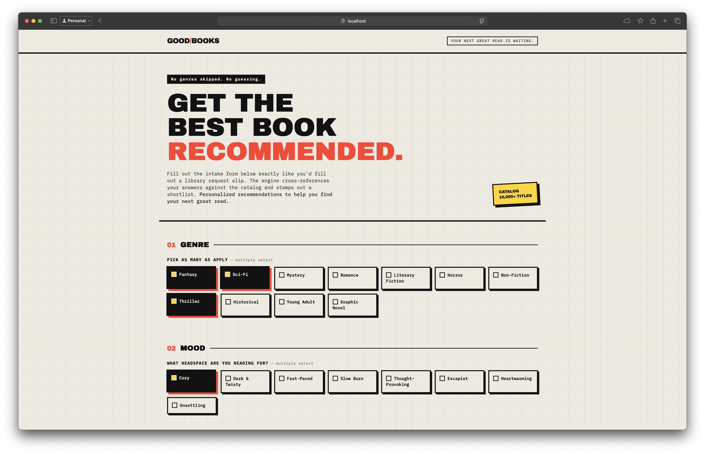
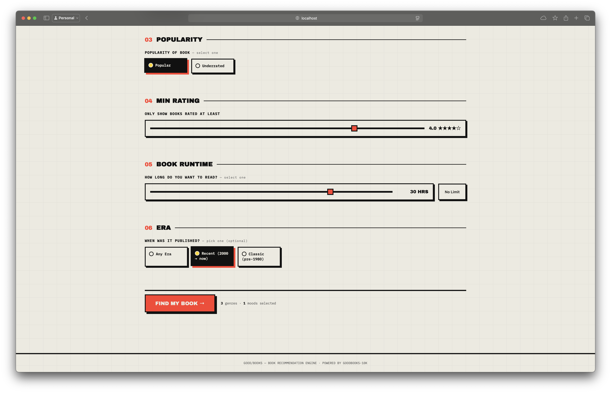
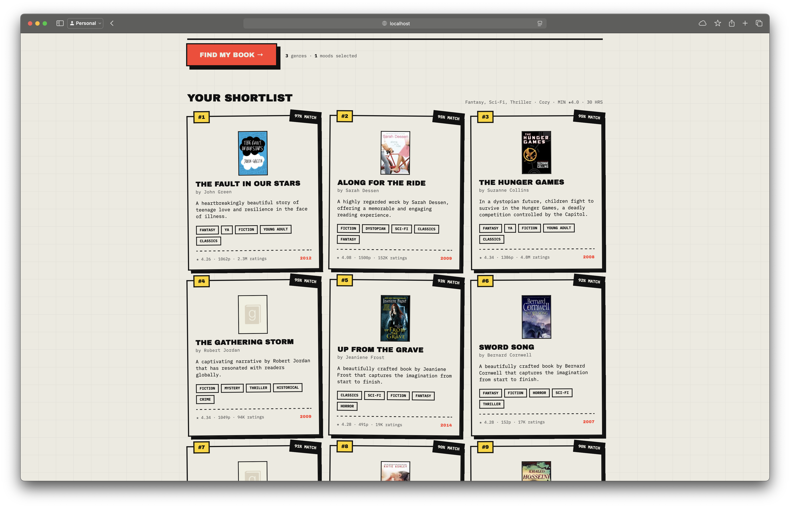

# GOOD/BOOKS — Personalized Book Recommendation Engine

> **Your next great read is waiting.**
> A full-stack, ML-powered book recommendation app built on the Goodbooks-10K dataset.
>
> **Live Demo**: This project is currently deployed on a live **Oracle Cloud Infrastructure (OCI) Instance**! Try the recommendation engine here: [goodbooks.pratham.dpdns.org](https://goodbooks.pratham.dpdns.org)

---

## Table of Contents

- [Overview](#overview)
- [Features](#features)
- [Tech Stack](#tech-stack)
- [Architecture](#architecture)
- [Data Flow](#data-flow)
- [Project Structure](#project-structure)
- [How the Recommender Works](#how-the-recommender-works)
  - [ML Model Training](#ml-model-training)
  - [Inference Pipeline](#inference-pipeline)
  - [Filters Explained](#filters-explained)
- [API Reference](#api-reference)
- [How To Use](#how-to-use)
- [Running Locally](#running-locally)
  - [Prerequisites](#prerequisites)
  - [Quick Start with Docker](#quick-start-with-docker)
  - [Running without Docker](#running-without-docker)
- [Retraining the Model](#retraining-the-model)
- [Frontend Overview](#frontend-overview)
- [Filter Defaults](#filter-defaults)
- [Dataset](#dataset)
- [Archive Folder](#archive-folder)
- [Documentation](#documentation)
- [Screenshots](#screenshots)
- [Author](#author)
- [Acknowledgements](#acknowledgements)
- [AI Transparency](#ai-transparency)

---

## Overview

**GOOD/BOOKS** is a personalized book recommendation web application. Users fill out a short preference form (genres, mood, popularity, rating, book length, and era), and the system returns their top 10 books matched by a trained Neural Network.

The recommendation engine is a **hybrid ML system** combining:
- A **Multi-Layer Perceptron (MLP)** classifier trained on 424,000+ pairwise user–book interactions.
- **TF-IDF + SVD** description embeddings for semantic content understanding.
- **Genre & mood multi-hot encoding** for preference alignment.
- **Hard filters** for rating, page count, publication era, and popularity.

---

## Features

- **Neural Network Recommendations** — MLP classifier trained on 424K+ real user interactions scores all 10,000 books simultaneously.
- **Genre & Mood Matching** — 39 genre labels + 8 mood labels encoded as preference vectors, not just keyword tags.
- **Semantic Description Similarity** — TF-IDF + TruncatedSVD embeds book descriptions into 64-dimensional semantic space.
- **Smart Hard Filters** — Minimum rating, page-count budget, publication era, and popularity preference applied post-ML.
- **Sub-100ms Inference** — All 10K books scored in a single batched forward pass.
- **40ms Cold Start** — Pre-seeded SQLite binary eliminates slow CSV-seeding on startup.
- **One-Command Docker Deploy** — `docker compose up --build` brings up both services with a shared bridge network.
- **Live Deployed** — Running on an Oracle Cloud Infrastructure VM at [goodbooks.pratham.dpdns.org](https://goodbooks.pratham.dpdns.org).

---


## Tech Stack

| Layer | Technology |
|---|---|
| **Frontend** | React 18 + TypeScript + Vite |
| **Styling** | Vanilla CSS (no framework) |
| **Backend API** | Python 3.11 + FastAPI + Uvicorn |
| **ML Model** | scikit-learn `MLPClassifier` |
| **Feature Engineering** | TF-IDF, TruncatedSVD, StandardScaler |
| **Database** | SQLite (WAL mode, seeded on first boot) |
| **Containerization** | Docker + Docker Compose |
| **Dataset** | Goodbooks-10K (Kaggle) |

---

## Architecture



Both services run inside Docker containers and communicate over an internal bridge network (`goodbooks-net`). The Vite dev-server proxies all `/api` requests to the FastAPI backend. The SQLite database is persisted via a named Docker volume (`goodbooks-data`).

---

## Data Flow

### ML Inference Pipeline



### End-to-End Request Lifecycle



---


## Project Structure

```
goodbooks/
├── docker-compose.yml          # Orchestrates frontend + backend containers
├── README.md
│
├── backend/                    # FastAPI application + ML engine
│   ├── Dockerfile
│   ├── requirements.txt
│   ├── main.py                 # API entry point, route definitions
│   ├── models.py               # Pydantic request/response models
│   ├── database.py             # SQLite schema + seeding logic
│   ├── ml_recommender.py       # MLBookRecommender inference class
│   ├── db/
│   │   ├── books_enriched.csv  # 10K books with genres, moods, pages
│   │   ├── tags.csv            # Goodreads tag vocabulary
│   │   └── book_tags.csv       # Book–tag association counts
│   └── model/
│       └── recommender.joblib      # Active production model
│
├── frontend/                   # React + TypeScript UI
│   ├── Dockerfile
│   ├── nginx.conf              # Nginx reverse-proxy config
│   ├── index.html
│   ├── package.json
│   ├── vite.config.ts
│   └── src/
│       ├── App.tsx             # Root component + form state
│       ├── constants.ts        # Genre/mood lists + filter defaults
│       ├── types.ts            # TypeScript interfaces (mirrors Pydantic)
│       ├── index.css           # Global styles
│       ├── api/
│       │   └── recommend.ts    # API client (fetch wrapper)
│       └── components/
│           ├── Header.tsx      # Top navigation bar
│           ├── Hero.tsx        # Landing headline section
│           ├── TileGroup.tsx   # Multi-select tile filter
│           ├── LengthSlider.tsx # Max book runtime slider
│           ├── RatingSlider.tsx # Min rating slider
│           └── BookCard.tsx    # Individual book recommendation card
│
└── archive/                    # Development history (not used by the app)
    ├── train_model.py          # Model training script — run this to retrain
    ├── recommender.py          # Legacy SQL-based recommender (replaced by ML)
    ├── build_enriched.py       # Script to build books_enriched.csv from SQLite
    ├── goodbooks_eda.py        # Exploratory Data Analysis notebook
    ├── generate_descriptions.py # Description generation utility
    ├── archive_eda.py          # Early EDA iteration
    └── eda/                    # EDA output charts (PNG)
```

---

## How the Recommender Works

### ML Model Training

The model is a **pairwise preference MLP classifier** trained on the Goodbooks-10K ratings dataset.

**Training script:** `archive/train_model.py`

**Steps:**
1. **Load data** — `books_enriched.csv` (10,000 books) + `ratings.csv` (981,756 ratings across 53,424 users).
2. **Engineer book features** — Each book is a **97-dimensional vector**:
   - Genre multi-hot (39 dims) — based on Goodreads tag mapping.
   - Mood multi-hot (8 dims) — inferred from description keywords.
   - Numeric features (4 dims) — pages, pub year, avg rating, log(ratings_count).
   - TF-IDF + TruncatedSVD description embedding (46 dims).
3. **Build training pairs** — For each user, their books are split into:
   - **Positive** (liked): books rated ≥ 4 stars.
   - **Negative** (disliked): books rated ≤ 2 stars.
   - Each training input = `concat(user_pref_vec[97], book_feat_vec[97])` = **194 dims**.
4. **Train** — `sklearn.neural_network.MLPClassifier` with early stopping.
5. **Evaluate** — ROC-AUC and Precision/Recall on a 15% held-out test split.
6. **Save** — Serialized model bundle saved to `backend/model/recommender.joblib`.

**Final model performance:**
```
ROC-AUC  = 0.8576
Accuracy = 77.1%
Precision: 0.73  |  Recall: 0.78
Training pairs: 424,202  |  Users: 53,424
```

---

### Inference Pipeline

When a user submits the form, `POST /api/recommend` is called and the following happens inside `MLBookRecommender.recommend()`:

1. **Build a 97-dim user preference vector** from selected genres, moods, rating, page limit, and era.
2. **Tile** the user vector against all 10,000 book feature vectors:  
   `X = concat(user[97], book[97])` → shape `(10000, 194)`.
3. **Score all books** in a single batch forward pass:  
   `scores = mlp.predict_proba(X)[:, 1]` — P(liked) for every book.
4. **Apply hard filters** — drop any book that fails:
   - `average_rating < minRating`
   - `pages > maxPages` (when a limit is set)
   - `pub_year` outside the selected era range
   - `ratings_count > 65,000` when `popularity == "underrated"`
5. **Sort** by ML score descending.
6. **Return** top 10 results.

---

### Filters Explained

| Filter | Field | Behaviour |
|---|---|---|
| **Genres** | `genres[]` | Influences genre multi-hot in the preference vector |
| **Mood** | `moods[]` | Steers MLP score via mood multi-hot encoding |
| **Popularity** | `popularity` | `popular` = no filter; `underrated` = excludes books with >65,000 ratings (top ~15%) |
| **Min Rating** | `minRating` | Hard filter — books below this avg rating are excluded |
| **Max Runtime** | `maxPages` | Hard filter on page count. Conversion: 50 pages/hour (e.g. 30 hrs = 1,500 pages) |
| **Era** | `pubEra` | `recent` = year ≥ 2000, `classic` = year < 1980, `any` = no filter |

---

## API Reference

Base URL (local): `http://localhost:18000`

Swagger docs: `http://localhost:18000/docs`

### `POST /api/recommend`

Returns up to 10 personalized book recommendations.

**Request body:**
```json
{
  "genres":     ["Fantasy", "Thriller"],
  "moods":      ["Cozy", "Escapist"],
  "minRating":  4.0,
  "maxPages":   1500,
  "pubEra":     "recent",
  "popularity": "popular"
}
```

**Response:**
```json
{
  "books": [
    {
      "title":          "The Name of the Wind",
      "author":         "Patrick Rothfuss",
      "genres":         ["Fantasy", "Fiction"],
      "moods":          [],
      "pitch":          "A legendary figure recounts his life story...",
      "match":          92,
      "average_rating": 4.55,
      "ratings_count":  497765,
      "pages":          662,
      "image_url":      "https://...",
      "pub_year":       2007
    }
  ],
  "count": 10,
  "query": { ... }
}
```

### `GET /api/health`

Returns backend health status and whether the database is seeded.

### `GET /api/options/genres`

Returns available genre labels (sourced from the loaded ML model).

### `GET /api/options/moods`

Returns available mood labels (sourced from the loaded ML model).

---

## How To Use

1. **Open** [http://localhost:18080](http://localhost:18080) in your browser (or the [live demo](https://goodbooks.pratham.dpdns.org)).
2. **Select Genres** — pick one or more genres that interest you (e.g. Fantasy, Thriller).
3. **Select Moods** — choose the reading vibe you're after (e.g. Cozy, Dark & Twisty).
4. **Choose Popularity** — `Popular` for well-known titles, `Underrated` to discover hidden gems.
5. **Set Min Rating** — drag the slider to your minimum acceptable star rating (default ★ 4.0).
6. **Set Book Runtime** — limit by estimated reading time, converted to page count at 50 pages/hr (default 30 hrs).
7. **Choose Era** — `Recent` (≥ 2000), `Classic` (< 1980), or `Any`.
8. **Click "FIND MY BOOK →"** — the ML engine scores all 10,000 books and returns your ranked shortlist in under 100ms.

---

## Running Locally

### Prerequisites

- [Docker Desktop](https://www.docker.com/products/docker-desktop/) installed and running.

### Quick Start with Docker

```bash
# 1. Clone the repository
git clone https://github.com/gititpratham/Goodbooks.git
cd Goodbooks

# 2. Build and start all services
docker compose up --build

# if the above command failes to build the image run the following command
sudo docker compose up --build

# Frontend → http://localhost:18080
# API Docs  → http://localhost:18000/docs
```

On **first boot**, the backend automatically seeds the SQLite database from `backend/db/`. This takes ~10–15 seconds. The database persists via a Docker volume so subsequent starts are instant.

**Rebuild a single service:**
```bash
docker compose build --no-cache frontend
docker compose up -d frontend
```

**Stop all containers:**
```bash
docker compose down
```

---

### Running without Docker

**Backend:**
```bash
cd backend
pip install -r requirements.txt
uvicorn main:app --reload --host 0.0.0.0 --port 18000
```

**Frontend:**
```bash
cd frontend
npm install
npm run dev
# Dev server starts at http://localhost:5173
```

---

## Retraining the Model

If you update `books_enriched.csv` or want to retrain from scratch:

```bash
python archive/train_model.py
```

This will:
1. Load `backend/db/books_enriched.csv` + `backend/db/ratings.csv`.
2. Build training pairs from all 53K users.
3. Train and evaluate a new MLP classifier.
4. Save to `backend/model/recommender.joblib`.

Then rebuild the backend to pick up the new model:
```bash
docker compose build --no-cache backend && docker compose up -d backend
```

---

## Frontend Overview

| Component | Purpose |
|---|---|
| `Header` | App logo and navigation bar |
| `Hero` | Landing headline and tagline |
| `TileGroup` | Multi-select tiles for Genres, Moods, and Era |
| `LengthSlider` | Max Book Runtime slider (10 / 15 / 20 / 30 / 40 hrs / No Limit) |
| `RatingSlider` | Minimum Star Rating slider (0.0 – 5.0) |
| `BookCard` | Book cover, title, author, description, genre chips, rating, page count, year |

---

## Filter Defaults

Pre-selected when the page loads:

| Filter | Default |
|---|---|
| Genres | Fantasy, Sci-Fi, Thriller |
| Mood | Cozy |
| Popularity | Popular |
| Min Rating | 4.0 stars |
| Max Book Runtime | 30 hrs (≤ 1,500 pages) |
| Era | Recent (≥ 2000) |

---

## Dataset

**Goodbooks-10K** by Zygmunt Zając — [Kaggle](https://www.kaggle.com/datasets/zygmunt/goodbooks-10k)

- 10,000 books (most popular on Goodreads)
- 981,756 user ratings, 53,424 users
- Tag/genre metadata from Goodreads bookshelves

Files in `backend/db/`:

| File | Description |
|---|---|
| `books_enriched.csv` | 10K books with genre, mood tags, and page counts |
| `tags.csv` | ~34K unique Goodreads tag names |
| `book_tags.csv` | ~1M book–tag count associations |

---

## Archive Folder

Development scripts kept for reference — **not used by the running app**:

| File | Purpose |
|---|---|
| `train_model.py` | ML training pipeline — run to retrain the model |
| `recommender.py` | Legacy SQL heuristic recommender (replaced by ML) |
| `build_enriched.py` | Built `books_enriched.csv` from the raw SQLite dump |
| `goodbooks_eda.py` | Exploratory Data Analysis of the raw dataset |
| `generate_descriptions.py` | Utility to generate book description summaries |
| `eda/` | EDA output charts (PNG images) |

---

## Documentation

Detailed documentation is available in the [`docs/`](docs/) folder:

| File | Description |
|---|---|
| [`docs/INSTALL.md`](docs/INSTALL.md) | Step-by-step installation and environment setup guide |
| [`docs/USAGE.md`](docs/USAGE.md) | Detailed usage guide, filter reference, and API walkthrough |
| [`docs/WHY.md`](docs/WHY.md) | Project background — why this project was chosen and what makes its approach different from a typical single-strategy recommender |

---

## Screenshots

**Intake Form — Genre & Mood Selection**



**Intake Form — Filters & CTA**



**Results — Your Shortlist**



---

## Author

**Pratham Patel**

[](https://github.com/gititpratham)

---

## Acknowledgements

This project was developed as part of a technical recruitment assessment.

**Open source technologies used:**
[FastAPI](https://fastapi.tiangolo.com) · [React](https://react.dev) · [Docker](https://www.docker.com) · [Scikit-learn](https://scikit-learn.org) · [Pydantic](https://docs.pydantic.dev) · [Vite](https://vitejs.dev) · [SQLite](https://sqlite.org)

Thanks to [Kaggle](https://www.kaggle.com) and [Zygmunt Zając](https://www.kaggle.com/datasets/zygmunt/goodbooks-10k) for making the Goodbooks-10K dataset publicly available.

The reasoning behind why this project was chosen, and what makes its approach different from a typical single-strategy recommender, is documented in [`docs/WHY.md`](docs/WHY.md).

---

## AI Transparency

For full transparency, I have used AI assistants to help speed up some of the repetitive tasks in this project:

- **Autocompletion:** I used the Antigravity IDE, which autocompletes using its Gemini 3.5 Flash model.
- **Syntax Generation:** For syntax generation and completion, I used Gemini 3.1 Pro (High).
- **Frontend & UI:** For a better UI and appealing frontend for users, I made a sketch and used Claude Sonnet 4.6 to take the idea from sketch to code.
- **Documentation:** The generation and proofreading of this README and the codebase docstrings were done by Gemini 3.5 Flash.

Aside from that, the rules of recommendation, EDA, the pre-processing techniques, and the Docker container logic were built by me.
