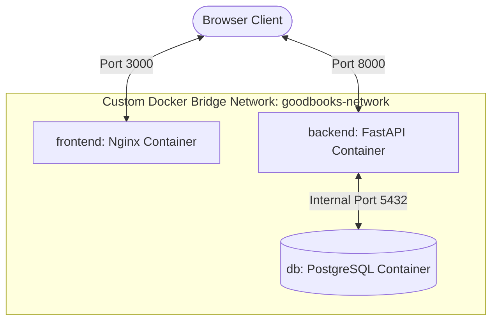

# BookVerse - Smart Book Recommendation Service

BookVerse is a full-stack, containerized **Book Recommendation and Matching Service** designed to help readers explore a catalog of 10,000 popular books and receive highly tailored suggestions. 

It provides two recommendation pathways:
1. **Item-to-Item Recommendations**: Suggests similar books based on the content of a selected book (e.g. "Readers also enjoyed").
2. **AI Preference Matching (Wizard)**: Uses a custom form to match reader-selected genres, keywords/mood, and minimum ratings to corresponding books.

---

## 🌟 Why This Project?

We chose a content-based recommendation system on the **Goodbooks-10k Extended** dataset for several key reasons:
- **No Cold-Start Problem**: Collaborative filtering models struggle with new items/users who have no ratings. Content-based filtering uses metadata (synopsis, author, genres), meaning every book can be recommended immediately upon insertion.
- **Explainability**: Recommendations are calculated mathematically via text similarity (TF-IDF), making the output easy to justify and explain to users (e.g. "recommended because it shares similar themes of space battles and science fiction").
- **Efficiency and Scalability**: Training a text-similarity matrix on 10,000 books takes less than a second on startup, and calculating recommendations is near-instantaneous (under 10ms), running smoothly in resource-constrained Docker containers without GPU overhead.

---

## 🛠️ Technology Stack

The project is structured with a strict physical and logical separation between components, communicating solely via standard REST APIs:

- **Frontend**: Pure **Vanilla TypeScript** compiled to modern ES Modules (`tsc`), with a custom responsive **Glassmorphism dark theme** styled in Vanilla CSS. No heavy UI frameworks (React/Vue/etc.) or bundlers (Vite) are used, resulting in extremely fast page load times and zero runtime client overhead.
- **Web Server**: **Nginx** (Alpine-based) containerized to serve static HTML, CSS, and compiled JS files.
- **Backend API**: **FastAPI** (Python 3.11) with **SQLAlchemy** ORM. FastAPI was chosen for its high performance, native async support, automated OpenAPI (Swagger) documentation, and built-in type validation via Pydantic.
- **Recommendation Engine**: Built with **scikit-learn** and **pandas**. It creates text profiles for all books, computes a TF-IDF matrix, and utilizes cosine similarity (linear kernel) for similarity calculations.
- **Database**: **PostgreSQL 15** (Alpine-based) running in its own dedicated container, persisting data via named volumes.
- **Orchestration**: **Docker Compose** managing separate container builds and networks.

---

## 🏗️ Architecture & Network Data Flow

The containers communicate over a custom Docker bridge network called `goodbooks-network`:



1. The user visits `http://localhost:3000`, which Nginx serves from Nginx's static folder.
2. The browser executes the compiled Vanilla TypeScript script, which sends HTTP requests directly to the FastAPI backend API at `http://localhost:8000`.
3. FastAPI queries PostgreSQL internally on port `5432` to retrieve and write data.

---

## 📊 Data Preparation & Sourcing

- **Declared Source**: The dataset is sourced from the [Goodbooks-10k Extended Github Repository](https://github.com/malcolmosh/goodbooks-10k-extended), which enriches Zygmunt Zając's original Goodbooks-10k dataset with descriptions, pages, publish dates, and top-shelf genre categories.
- **Database Seeding**: On container startup, the FastAPI application automatically detects if the database is empty. If it is, it parses `backend/data/books_enriched.csv` using `pandas`, handles NaN values (e.g. substituting empty strings for descriptions, setting pages to 0), drops duplicates on `book_id`, and batch-inserts the 10,000 cleaned book objects into PostgreSQL in chunks of 1000.
- **Feature Engineering**: To compute similarities, we build a weighted metadata document for each book:
  $$\text{Document} = \text{Title} \times 2 + \text{Authors} \times 2 + \text{Genres} \times 2 + \text{Description}$$
  Repeating titles, authors, and genres increases their term frequencies (TF), giving them higher priority weight in cosine similarity than matches inside the long synopsis descriptions.

---

## ⚡ Plug-and-Play Setup (Docker Compose)

### Prerequisites
- Docker and Docker Compose installed.
- Ensure ports `3000` and `8000` are free on your host machine.

### Run Instructions
1. Clone the repository and navigate to the project directory:
   ```bash
   git clone https://github.com/gititpratham/Goodbooks.git
   cd Goodbooks
   ```
2. Build and run the multi-container application:
   ```bash
   docker compose up --build
   ```
3. Open your browser and navigate to:
   - **Frontend App**: [http://localhost:3000](http://localhost:3000)
   - **Interactive API Documentation (Swagger)**: [http://localhost:8000/docs](http://localhost:8000/docs)

*Note: On first startup, the backend container waits for PostgreSQL to accept connections, initializes the schema, and inserts 10,000 books. This seeding process may take 10-15 seconds. You can track progress in the terminal logs.*

---

## 📡 API Reference Endpoints

### 1. Catalog & Metadata
- **`GET /health`**
  - Simple health check.
- **`GET /api/genres`**
  - Returns a sorted list of all unique genres parsed from the database.
- **`GET /api/books`**
  - Query parameters:
    - `page` (default 1): Page number.
    - `limit` (default 20): Items per page.
    - `search`: Filter by Title or Author name (case-insensitive substring).
    - `genre`: Filter by genre tag.
  - Returns: `{ total, page, limit, books: [...] }`

### 2. Recommendations
- **`POST /api/recommend/by-book`**
  - Request body:
    ```json
    {
      "book_id": 1,
      "limit": 10
    }
    ```
  - Returns: 10 books most similar to the selected book based on content profile.
- **`POST /api/recommend/by-preferences`**
  - Request body:
    ```json
    {
      "genres": ["Fantasy", "Science Fiction"],
      "keywords": "space battle stars magic",
      "min_rating": 3.8,
      "limit": 12
    }
    ```
  - Returns: Highly matching books. If filters are too strict, it fills the remainder with popular, highly-rated books to ensure a smooth user experience.